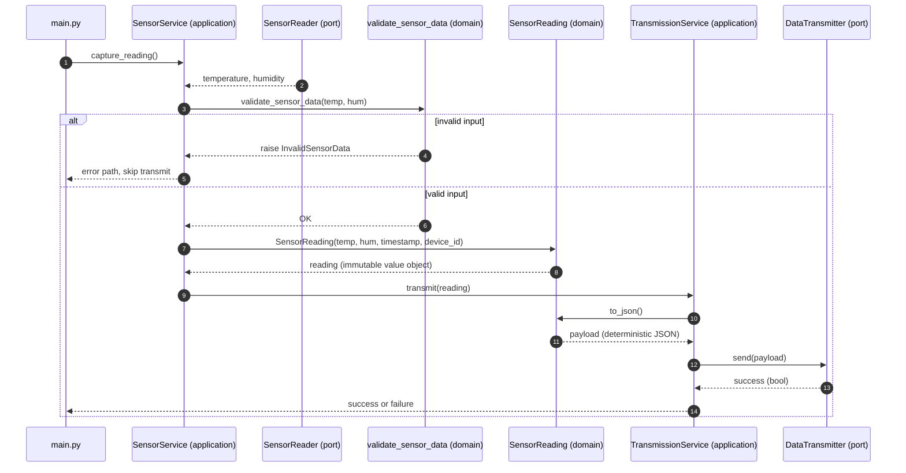

```mermaid
sequenceDiagram
    autonumber
    participant Main as main.py
    participant App as SensorService (application)
    participant Reader as SensorReader (port)
    participant Validator as validate_sensor_data (domain)
    participant Model as SensorReading (domain)
    participant TxSvc as TransmissionService (application)
    participant Tx as DataTransmitter (port)

    Main->>App: capture_reading()
    Reader-->>App: temperature, humidity
    %% types: float or None, float or None

    App->>Validator: validate_sensor_data(temp, hum)
    alt invalid input
        Validator-->>App: raise InvalidSensorData
        App-->>Main: error path, skip transmit
    else valid input
        Validator-->>App: OK
        App->>Model: SensorReading(temp, hum, timestamp, device_id)
        Model-->>App: reading (immutable value object)

        App->>TxSvc: transmit(reading)
        TxSvc->>Model: to_json()
        Model-->>TxSvc: payload (deterministic JSON)
        TxSvc->>Tx: send(payload)
        Tx-->>TxSvc: success (bool)
        TxSvc-->>Main: success or failure
    end
```